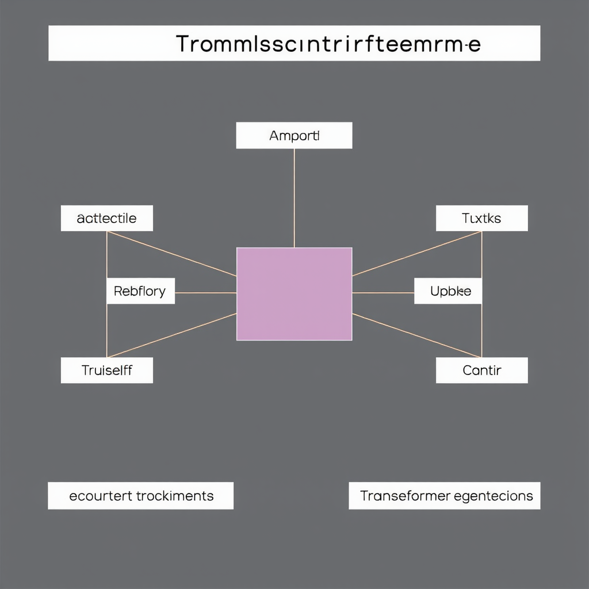
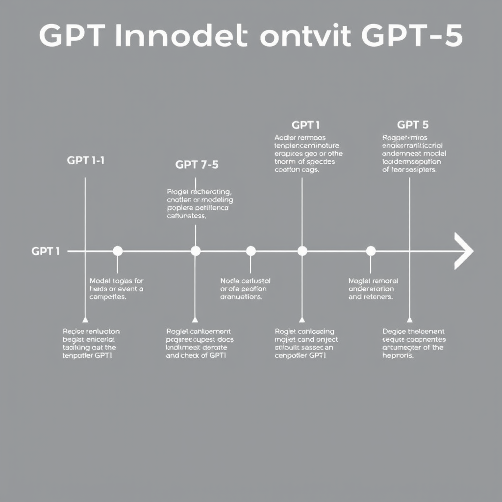

# GPT Models

## Introduction to GPT Models

Generative Pre-trained Transformers (GPT) are a class of AI models designed for natural language processing tasks. At their core, GPT models utilize a transformer architecture, which enables them to process and generate text with remarkable efficiency. This architecture relies on self-attention mechanisms, allowing the models to weigh the importance of different words in a sentence and understand context, which is crucial for generating coherent responses.


*A diagram illustrating the transformer architecture used in GPT models, highlighting self-attention and context processing.*

The evolution of GPT models has been significant, starting with GPT-1 and progressing through to the latest versions, such as GPT-4 and GPT-5. Each iteration has brought enhancements in capability and performance. GPT-1 laid the groundwork by demonstrating the potential of pre-training on large datasets and fine-tuning for specific tasks. GPT-2 followed, introducing a more extensive dataset and improving the model's response quality. With GPT-3, the leap in model size and complexity was marked, leading to dramatic improvements in language understanding and generation. The latest versions, including GPT-4 and GPT-5, have focused on refining these capabilities, with features like better contextual understanding and reduced biases, allowing for more sophisticated interactions (see sources: [Evolution of GPT Models](https://blog.stackademic.com/the-evolution-of-gpt-models-from-gpt-3-to-gpt-4o-and-beyond-b9a3c574cd95), [OpenAI Models Overview](https://zapier.com/blog/openai-models)).

Training these models involves exposure to diverse datasets sourced from books, articles, and websites, which broadens their knowledge base and helps them generate responses relevant to a wide array of topics. This extensive training process enables them to understand nuances in language, idiomatic expressions, and even context-dependent questions, positioning GPT models as powerful tools in AI and machine learning development (see sources: [OpenAI Model Training](https://datasciencedojo.com/blog/the-complete-history-of-openai-models-from-gpt-1-to-gpt-5), [ChatGPT Versions](https://www.gradually.ai/en/chatgpt-versions)).

## Key Features of the Latest GPT Models

The latest iterations of GPT models, especially GPT-4o, have introduced noteworthy enhancements that significantly improve their reasoning abilities. Unlike its predecessors, GPT-4o exhibits a more refined ability to understand complex prompts and generate nuanced responses. This enhancement enables the model to tackle intricate queries more effectively, positioning it as a powerful tool for applications requiring sophisticated understanding and problem-solving capabilities.

Another critical improvement in the newer models is the expansion of context windows. While previous models had constraints on how much text they could consider in a single input, GPT-4o and its kin have increased context windows that allow for greater amounts of text to be processed simultaneously. This enhancement translates into more coherent and context-aware text generation. For developers and applications that rely on maintaining context over longer interactions, such as chatbots or narrative generation, these improvements can substantially elevate user experience and output quality. 


*A timeline chart showing the evolution of GPT models from GPT-1 to GPT-5, highlighting key improvements and features introduced in each version.*

Speed and accuracy have also been focal points in refining GPT models. Comparisons between models like GPT-4o, GPT-4 Turbo, and even GPT-5 indicate not just marginal improvements, but significant performance boosts across various tasks. Users of these models can expect faster response times, making implementations in real-time applications, such as customer service or live content generation, much more feasible. Furthermore, the accuracy of outputs has seen enhancements, allowing the models to provide more relevant and factually correct information, which is essential for reliable applications in areas like education or technical support.

In summary, the evolution from prior GPT models to the latest iterations, particularly with GPT-4o, encompasses:

- Enhanced reasoning capabilities that aid in more complex tasks and queries.
- Expanded context windows resulting in coherent and contextually relevant outputs.
- Improved speed and accuracy making the models suitable for real-time applications.

These advancements underscore a clear trajectory toward more intelligent and responsive AI systems, making them valuable assets for developers in various domains.  

For further details on these models and their performance, you can explore the comprehensive comparisons and analyses available in various resources ([OpenAI Models](https://zapier.com/blog/openai-models), [Evolution of GPT Models](https://blog.stackademic.com/the-evolution-of-gpt-models-from-gpt-3-to-gpt-4o-and-beyond), [Model Release Notes](https://help.openai.com/en/articles/9624314-model-release-notes)).

## Practical Applications of GPT Models

GPT models have become instrumental across various sectors, showcasing their versatility and effectiveness. Here’s a closer look at some real-world applications.

### Customer Support Automation and Content Generation

One of the most prominent use cases for GPT models is in customer support automation. Companies leverage these models to create intelligent chatbots that can handle customer inquiries efficiently, reducing wait times and improving user satisfaction. By understanding and processing natural language, these AI-driven systems can provide accurate responses and troubleshoot issues without human intervention. For instance, businesses are using GPT models to auto-generate FAQ responses, manage ticketing systems, and facilitate user interactions through conversational interfaces.

In addition to customer support, GPT models excel in content generation. Media companies and marketers are increasingly using them to draft articles, generate social media posts, and curate newsletters. By analyzing trends and catering to specific audience preferences, GPT can produce high-quality content quickly and at scale. This allows creative teams to focus on strategic tasks while relying on AI to handle the heavy lifting of routine content production.

### Success Stories in Data Analysis and Summarization

Another exciting area where GPT models shine is in data analysis and summarization. Organizations have successfully integrated these models to condense large datasets into comprehensible summaries, extracting key insights without needing extensive data science expertise. For example, financial analysts use GPT to generate concise reports from complex financial data, allowing stakeholders to make informed decisions rapidly.

There have also been numerous success stories in academic settings. Researchers utilize GPT models to summarize lengthy papers and extract relevant findings, streamlining the literature review process. By minimizing the time spent deciphering dense texts, these models empower researchers to focus on their core objectives—making valuable contributions to their fields.

### Integration Examples Across Industries

The integration of GPT models spans various industries and software products. In the healthcare sector, for example, GPT-powered applications assist in patient record summarization, enabling healthcare providers to access critical information at a glance. Similarly, in the education space, adaptive learning platforms utilize GPT to provide personalized tutoring experiences, generating tailored learning materials based on individual user needs.

In the tech industry, software development tools integrate GPT models to assist programmers by suggesting code snippets and providing documentation. These integrations help streamline workflows, reduce coding errors, and enhance productivity across teams.

Overall, GPT models have firmly established themselves as valuable assets, transforming customer support, content creation, data analysis, and software development across industries. As the technology continues to evolve, we can expect even broader applications and deeper integrations in everyday workflows.

## Common Mistakes When Using GPT Models

Deploying GPT models can significantly enhance applications, but there are common pitfalls developers should be aware of to ensure optimal use.

- **Misunderstanding the Model's Ability**: One frequent mistake is assuming that the model will always generate contextually appropriate responses. GPT models are trained on large text datasets, which means they can produce inaccurate or misleading information if not carefully guided. Misinterpretation of a prompt can lead to outputs that do not accurately represent facts or underlying contexts. Always validate significant insights generated by the model with trustworthy sources to prevent misinformation.

- **Ignoring Token Limits**: Each model operates within specific token limits, which includes both input and output tokens. Failing to adhere to these limits can result in truncated responses or nonsensical completions. It's essential to structure prompts effectively to ensure that they fit within the model's constraints, particularly for applications requiring longer interactions or detailed information.

- **Neglecting Validation and Fine-tuning**: Another common oversight is not validating or fine-tuning the model's outputs. Relying on raw outputs without additional checks can compromise the quality of the generated content, especially for specialized applications. Fine-tuning the model on domain-specific datasets and continuously testing its outputs can enhance relevance and accuracy, significantly improving user experience and application reliability.

By being aware of these mistakes and implementing strategies to mitigate them, developers can harness the full potential of GPT models and deliver high-quality applications.

## Performance and Cost Considerations

When selecting a GPT model for your project, evaluating the cost-per-token pricing is essential for budgeting effectively. OpenAI's models vary in their pricing structures, which can directly impact the overall cost of running applications. For instance, while more advanced models may deliver better performance, they often come with increased token costs. It's crucial to analyze the specific pricing tiers for each model to determine the best fit for your budget, ensuring you achieve a balance between expenses and expected outcomes. 

Next, consider the trade-offs between quality and computational resources, particularly when comparing models such as GPT-4 and GPT-4 Turbo. GPT-4 offers high-quality responses, beneficial for tasks requiring nuanced understanding and detail. However, it demands more computational resources, leading to higher costs. On the other hand, GPT-4 Turbo is optimized for efficiency; it typically processes requests faster while maintaining a comparable output quality. Understanding the specific requirements of your application can guide you in choosing the model that aligns best with your performance expectations and budget constraints. 

Lastly, efficiency in response time versus output quality is a pivotal consideration in model selection. Different models exhibit varying response times, impacting user experience. If speed is a priority—such as in real-time applications—opting for a faster model like GPT-4 Turbo may be advantageous despite a potential slight dip in response quality. Conversely, for applications where detail and accuracy are paramount—such as comprehensive reports or complex inquiries—a model like GPT-4 might be the better choice despite longer processing times. 

In summary, evaluating the cost-per-token pricing, understanding quality and resource trade-offs, and balancing response time with output quality are critical steps in choosing the appropriate GPT model for your needs. Making informed decisions based on these factors will enhance your application's effectiveness while staying within budget.

## Debugging and Optimizing GPT Integrations

Debugging and optimizing your GPT integrations are crucial steps for ensuring high performance and reliability. Here’s how to effectively implement these strategies.

### Use Logging and Monitoring Tools

Implement logging and monitoring tools to trace model outputs and catch errors in real-time. This allows you to capture the input-output sequences that can help diagnose issues. Use libraries such as `logging` in Python to log inputs, outputs, and exceptions.

```python
import logging

logging.basicConfig(level=logging.INFO)

def get_model_response(prompt):
    try:
        # Assuming 'model' is your instantiated GPT model
        response = model.generate(prompt)
        logging.info(f"Prompt: {prompt} | Response: {response}")
        return response
    except Exception as e:
        logging.error(f"Error occurred: {e}")
```

### Apply Prompt Engineering Techniques

Prompt engineering is essential for guiding model responses towards more accurate outputs. Evaluate the structures of your prompts — the way you frame them can significantly influence the quality of responses. Experiment with different styles and formats, such as providing examples within the prompt or specifying desired formats.

For example, instead of a vague prompt like, "Tell me about AI," use a more directed one: "Explain how machine learning differs from traditional programming with an example." This kind of specificity helps the model focus on the relevant aspects you wish to address.

### Implement Feedback Loops

Feedback loops are invaluable for iteratively improving model performance based on user interactions. Collect feedback from users concerning the accuracy and usefulness of the model's responses. You can set up a system where users can report the quality of responses, which can then inform further training data or adjustments to your prompts.

To effectively create feedback loops, consider using surveys or rating systems within your application that users can easily access. This helps you identify patterns in user input and improve future interactions.

In summary, by logging your interactions, carefully designing prompts, and implementing user feedback, you can create a robust framework that enhances the efficacy of GPT integrations. These practices not only help in debugging issues but also aid in fine-tuning the models to meet user needs effectively.

## Conclusion

Choosing the right GPT model is crucial for achieving optimal results in your projects. Each model has unique strengths and capabilities that cater to varied use cases. For instance, GPT-4o offers enhanced performance, particularly in complex tasks compared to its predecessors. Understanding these nuances allows developers to leverage the most suitable model for their specific needs, ensuring efficient implementation and better outcomes.

As the landscape of AI continues to evolve, it is essential for developers to engage in continuous learning. OpenAI and other organizations regularly update models and release new versions that incorporate advanced features and improvements. Staying informed about these advancements can enhance your skill set and ensure you’re utilizing cutting-edge technology in your applications.

Moreover, ongoing research in GPT technology suggests that significant developments are on the horizon. Future models are expected to integrate even more sophisticated capabilities, addressing limitations of current systems while unlocking new possibilities for creative and practical applications across various industries. By remaining adaptable and open to change, developers can effectively harness the potential of future advancements in GPT models, ensuring their projects stay relevant and forward-thinking.